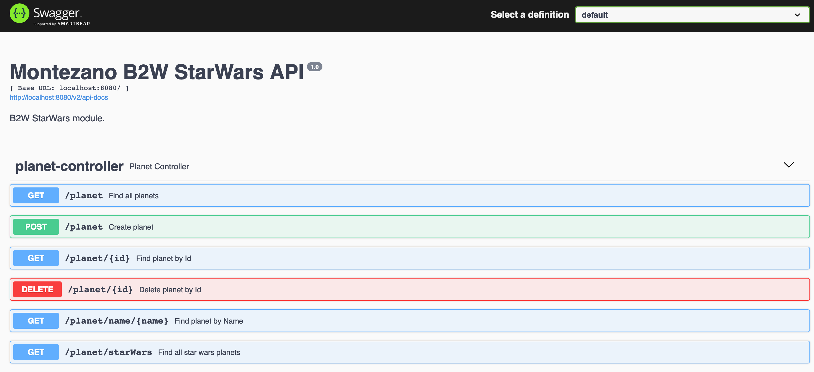
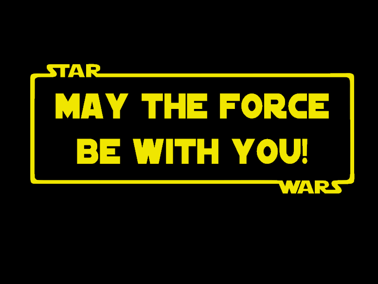

# b2w-backend-challenge
Desafio AME Digital Fintech (B2W)

## Tecnologia, arquitetura e padrões

- Java 8;
- MongoDB;
- Apache Kafka;
- Maven para *build* e *dependências* do projeto
- Aplicação desenvolvida com base nos conceitos de Clean Architecture

**Frameworks, utilitários e plugins**

- Testes feitos com JUnit4, Mockito e Hamcrest matchers para tornar os *asserts* mais elegantes;
- Spring Boot 2.1.3
- Spring WebFlux (Reactive)
- Spring Data Mongo Reactive
- Spring Kafka
- Utilitário lombok
- Metricas de coverage com Jacoco
- Documentação com Swagger - SpringFox


### Start

Antes de subir o projeto, inicie com o docker-compose a infraestrutura:

```
docker-compose -f /infra/b2w-starwars-app-compose.yml up -d
```
**PS: Você pode também optar por instalar manualmente o mongoDB e Apache Kafka.**

### Vamos lá

- Baixar o repositório para maquina:

```sh
git clone https://github.com/ThiagoMontezano/b2w-backend-challenge.git
```
- Ir para o path do projeto:

```sh
...
$ cd b2w-backend-challenge
$ mvn clean install
```
- Para executar o projeto na ausência de uma IDE:

```bash
...
java -jar target/b2w-starwars-0.0.1-SNAPSHOT.jar
```

Acesse o swagger da app ou importar a collection para o postman para realizar os devidos testes.

**PS: Porta default configurada na aplicação *8080***

```sh
...
swagger -> http://localhost:8080/swagger-ui.html#/

postman -> cd infra\B2W-Star-Wars.postman_collection.json
```

### Swagger
<p>
  
</p>

Divirta-se!

<p>
  
</p>

